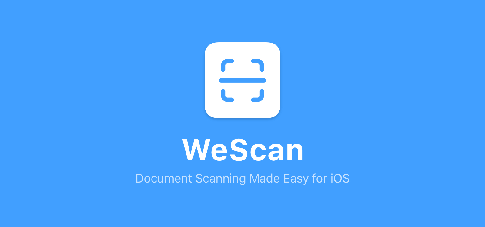
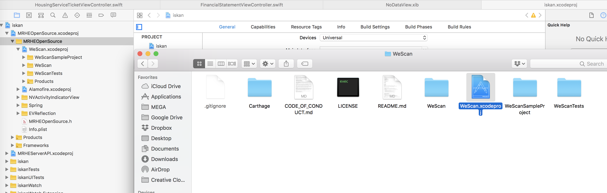
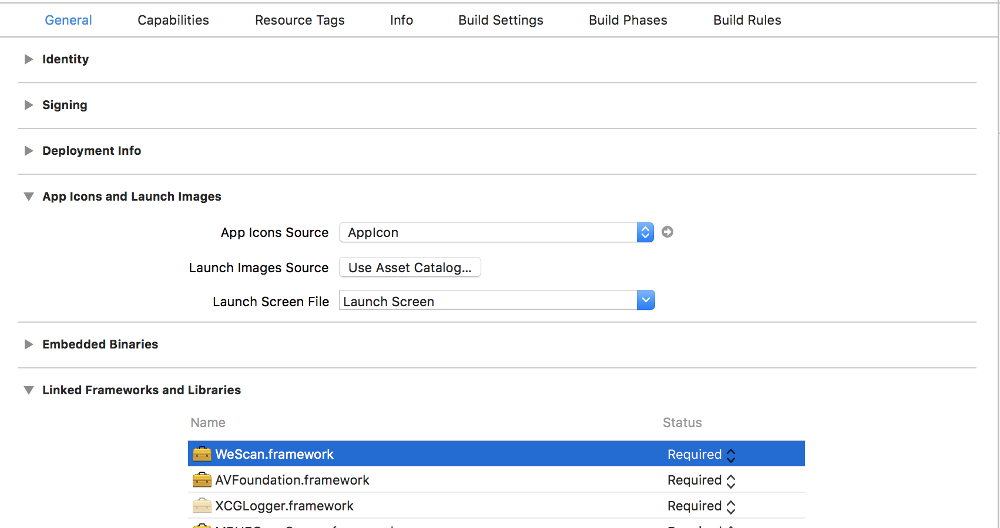

# WeScan

<p align="center">
    
</p>

<p align="center">


</p>

**WeScan** makes it easy to add scanning functionalities to your iOS app!
It's modelled after `UIImagePickerController`, which makes it a breeze to use.

- [Features](#features)
- [Demo](#demo)
- [Requirements](#requirements)
- [Installation](#installation)
- [Usage](#usage)
- [Contributing](#contributing)
- [License](#license)

## Features

- [x] Fast and lightweight
- [x] Live scanning of documents
- [x] Edit detected rectangle
- [x] Auto scan and flash support
- [x] Support for both PDF and UIImage
- [x] Translated to English, Chinese, Italian, Portuguese, and French
- [ ] Batch scanning

## Demo

<p align="left">
    
</p>

## Requirements

- Swift 5.0
- iOS 10.0+

<br>

## Installation

### Swift Package Manager

The [Swift Package Manager](https://swift.org/package-manager/) is a tool for automating the distribution of Swift code and is integrated into the `swift` compiler. It is in early development, but WeScan does support its use on supported platforms.

Once you have your Swift package set up, adding WeScan as a dependency is as easy as adding it to the `dependencies` value of your `Package.swift`.

```swift
dependencies: [
    .package(url: "https://github.com/WeTransfer/WeScan.git", .upToNextMajor(from: "1.7.0"))
]
```

### Carthage

[Carthage](https://github.com/Carthage/Carthage) is a decentralized dependency manager that builds your dependencies and provides you with binary frameworks.

To integrate **WeScan** into your Xcode project using Carthage, specify it in your `Cartfile`:

```ogdl
github "WeTransfer/WeScan" >= 0.9
```

Run `carthage update` to build the framework and drag the built `WeScan.framework` into your Xcode project.

### Manually

Just download the project, and drag and drop the "WeScan" folder in your project.

<p align="center">
    
</p>

Simply add the WeScan framework in the project's Embedded Binaries and Linked Frameworks and Libraries.

<p align="center">
    
</p>

## Usage

### Swift

1. In order to make the framework available, add `import WeScan` at the top of the Swift source file

2. In the Info.plist, add the `NSCameraUsageDescription` key and set the appropriate value in which you have to inform the user of the reason to allow the camera permission

3. Make sure that your view controller conforms to the `ImageScannerControllerDelegate` protocol:

```swift
class YourViewController: UIViewController, ImageScannerControllerDelegate {
    // YourViewController code here
}
```

4. Implement the delegate functions inside your view controller:

```swift
func imageScannerController(_ scanner: ImageScannerController, didFailWithError error: Error) {
    // You are responsible for carefully handling the error
    print(error)
}

func imageScannerController(_ scanner: ImageScannerController, didFinishScanningWithResults results: ImageScannerResults) {
    // The user successfully scanned an image, which is available in the ImageScannerResults
    // You are responsible for dismissing the ImageScannerController
    scanner.dismiss(animated: true)
}

func imageScannerControllerDidCancel(_ scanner: ImageScannerController) {
    // The user tapped 'Cancel' on the scanner
    // You are responsible for dismissing the ImageScannerController
    scanner.dismiss(animated: true)
}
```

5. Finally, create and present a `ImageScannerController` instance somewhere within your view controller:

```swift
let scannerViewController = ImageScannerController()
scannerViewController.imageScannerDelegate = self
present(scannerViewController, animated: true)
```

### Objective-C

1. Create a dummy swift class in your project. When Xcode asks if you'd like to create a bridging header, press 'Create Bridging Header'
2. In the new header, add the Objective-C class (`#import myClass.h`) where you want to use WeScan
3. In your class, import the header (`import <yourProjectName.swift.h>`)
4. Drag and drop the WeScan folder to add it to your project
5. In your class, add `@Class ImageScannerController;`

#### Example Implementation

```objc
ImageScannerController *scannerViewController = [[ImageScannerController alloc] init];
[self presentViewController:scannerViewController animated:YES completion:nil];
```

<br>

## Deployment of new Pod version

1. This steps were tested with CocoaPods version: `1.15.2`.
2. Should have Contributor permissions to repo: [NassaWeScan](https://github.com/NASSA-digital-lab/nassa-wescan), this access is granted by Nassa Admin: [Email](devops@assanet.com)
3. For more information about these steps, refer to: 
    - [Create Release](https://medium.com/@robdeans/creating-and-uploading-your-own-cocoapods-a1c3f3b5061)
    - [Publish New Version](https://theblueprototype.medium.com/how-to-create-publish-cocoapods-library-5bf305393c86)

### 1. Add a new version TAG

This step is important, due to Cocoa Pods will upload and update the `Release` section on our git repository.

1. Upgrade manually the value of `spec.version` on the `NassaWeScan.podspec` file, based on it type, example:
    - Patch change: value from `1.1.3` to `1.1.4`
    - Minor change: value from `1.1.1` to `1.2.0`
    - Major change: value from `1.1.1` to `2.0.0`

### 2. Make sure you upload your changes with corresponding tags

Upload your changes to Github with flag `--tags`, example: `git push -u origin main --tags`. This will ensure that your changes are being uploaded wit the Tags, so CocoaPods will create a new artifact.

### 3. Update Pod Repo

Once your changes are in your remote branch, run the following command on the root repository, where `NassaWeScan.podspec` file is located: `pod repo push NassaWeScan NassaWeScan.podspec --allow-warnings`. Once the command is finished, your pod is ready to be published.

## Publish new Pod version

Once your new version is updated and ready to publish, just run the command: `pod trunk push NassaWeScan.podspec --allow-warnings`

## Contributing

As the creators, and maintainers of this project, we're glad to invite contributors to help us stay up to date. Please take a moment to review [the contributing document](CONTRIBUTING.md) in order to make the contribution process easy and effective for everyone involved.

- If you **found a bug**, open an [issue](https://github.com/WeTransfer/WeScan/issues).
- If you **have a feature request**, open an [issue](https://github.com/WeTransfer/WeScan/issues).
- If you **want to contribute**, submit a [pull request](https://github.com/WeTransfer/WeScan/pulls).

<br>

## License

**WeScan** is available under the MIT license. See the [LICENSE](https://github.com/WeTransfer/WeScan/blob/develop/LICENSE) file for more info.
